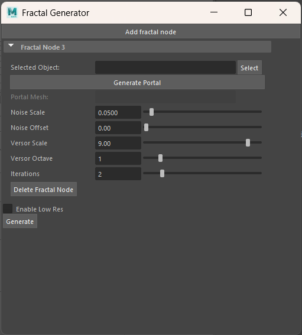

MASSGen - Maya Arbitrary Self-Similar Fractal Generator - Alan Lee, Lijun Qu
======================

User Tutorial
------------
Welcome to MASSGen, a powerful Maya plugin for generating arbitrary self-similar fractal structures! This tutorial will guide you through the installation process and demonstrate how to use the various features of the tool to create intricate and visually stunning fractal geometries.

Table of Contents
---------
1. Introduction
2. Installation
3. Basic Concepts
4. User Interface
5. Creating Your First Fractal
6. Advanced Features
7. Tips and Tricks
8. Troubleshooting
9. Example Presets

Introduction
------------
MASSGen (Maya Arbitrary Self-Similar Fractal Generator) is designed to enable artists and modelers to create self-similar fractal structures with direct control over where self-similarity appears. Using principles from the paper "Into the Portal: Directable Fractal Self-Similarity" by Schor et al., this tool extends traditional Julia set fractals by introducing portals, allowing our users to specify exact locations for self-similarity and the proportion of fractal noise in their 3D models.

Installation
------------
1. System Requirements:
- 64-bit Intel® or AMD® with SSE4.2 instruction set (or Apple Silicon/Intel for macOS)
- 8 GB of RAM minimum
- Windows 7 or later
- Maya 2022 or later

2. Installation Steps:
- Download the MASSGen plugin files from our GitHub repository
- Extract the ZIP file to a location on your computer
- Copy the plugin files to your Maya plugins directory:
    Windows: C:\Users\[YourUsername]\Documents\maya\[MayaVersion]\plug-ins
    Mac: /Users/[YourUsername]/Library/Preferences/Autodesk/maya/[MayaVersion]/plug-ins
    Linux: /home/[YourUsername]/maya/[MayaVersion]/plug-ins
- Launch Maya and load the plugin:
    Go to Windows -> Settings/Preferences -> Plug-in Manager
    Click on "Browse" and find "MASSGen.mll" in the list and check both "Loaded" and "Auto load"
    After loading the .mll plugin, you can find "Fractal Plugin" in the Maya menu bar. Click on it, and click on "Open Selection UI".

Basic Concepts
--------------
Before diving into using MASSGen, it's important to understand the key concepts of fractal self-similarity:
1. Self-similarity: A property where an object appears similar to itself at different scales
2. Julia Set: A type of fractal boundary in the complex plane
3. Portal: A region that defines where self-similarity should occur in your model
4. Alpha Parameter: Controls the "thinness" of the fractal details
5. Iterations: Determines the depth of recursive detail in the fractal

User Interface
--------------
The MASSGen interface provides comprehensive controls for creating and manipulating fractal self-similarity in your meshes:

Operation Buttons:

- Add Fractal Node: Creates a fractal node that defines a region where self-similarity will be applied to the mesh
- Delete Fractal Node: Removes the currently selected fractal node from the scene
- Selected Object: Input the mesh that need to have self-similarity
- Select: Selects the target object for fractal generation
- Generate Portal: Creates the portal map (transformation matrix) that determines exactly how the self-similarity transformations will be applied
- Generate: Processes the settings and generates the fractal mesh
- Presets: 

Parameter Controls

- Noise Scale: Controls the scale of the noise pattern applied to the fractal
- Noise Offset: Shifts the noise pattern
- Versor Scale: Adjusts the scale of the versor field (controls fine details)
- Versor Octave: Sets the complexity of the versor field patterns
- Iterations: Determines the recursion depth of the fractal (higher values create more detail but increase processing time)

Note: After clicking "Generate Portal," you can further refine the portal's effect by using standard Maya operations (translate, rotate, scale) directly on the portal mesh. These adjustments will be reflected in the final fractal generation.

Troubleshooting
--------------

Examples Results
----------------

Technical Background
--------------------