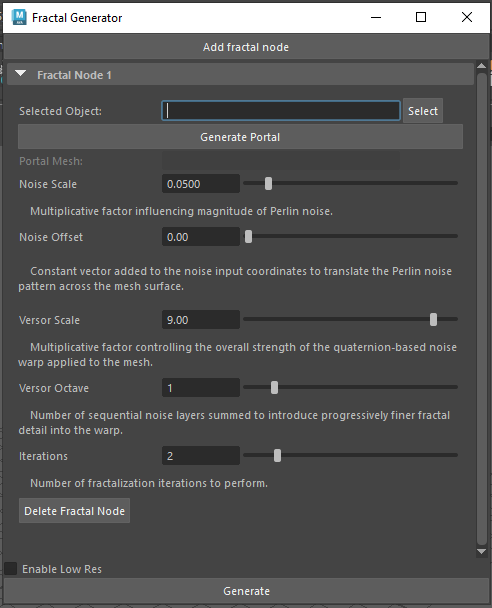
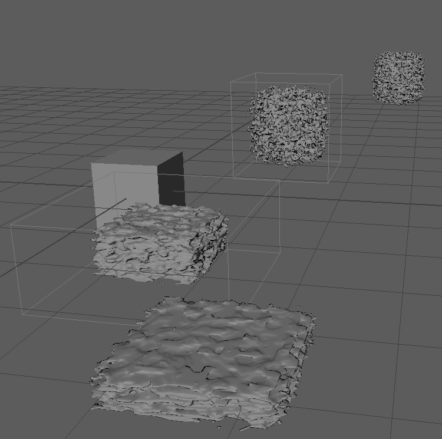
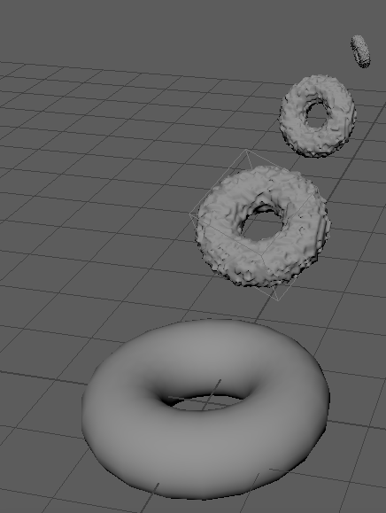
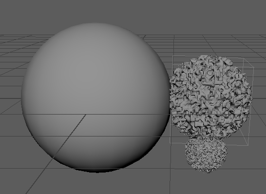
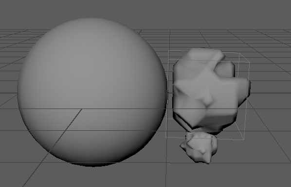
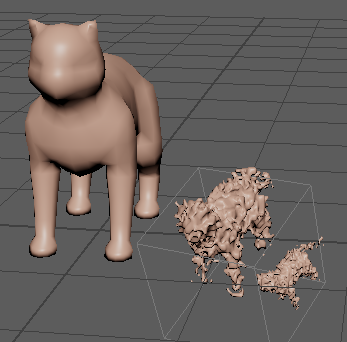
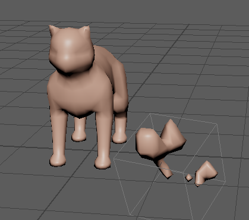
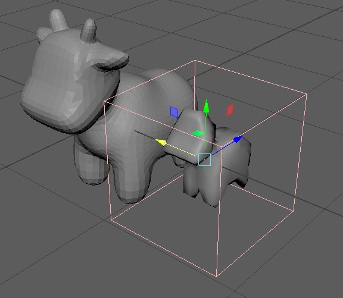
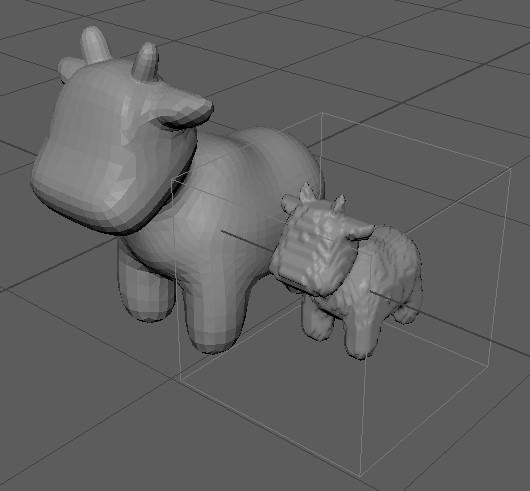
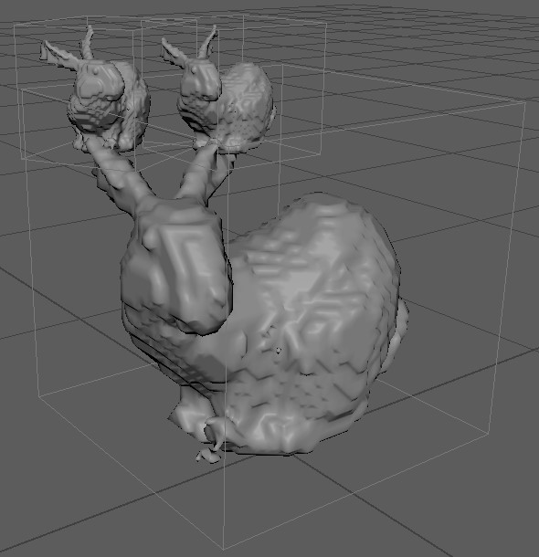

MASSGen - Maya Arbitrary Self-Similar Fractal Generator - Alan Lee, Lijun Qu
======================

User Tutorial
------------
Welcome to MASSGen, a powerful Maya plugin for generating arbitrary self-similar fractal structures! This tutorial will guide you through the installation process and demonstrate how to use the various features of the tool to create intricate and visually stunning fractal geometries.

Table of Contents
---------
1. Introduction
2. Installation
3. Basic Concepts
4. User Interface
5. Creating Your First Fractal
6. Advanced Features
7. Tips and Tricks
8. Troubleshooting
9. Example Results

Introduction
------------
MASSGen (Maya Arbitrary Self-Similar Fractal Generator) is designed to enable artists and modelers to create self-similar fractal structures with direct control over where self-similarity appears. Using principles from the paper "Into the Portal: Directable Fractal Self-Similarity" by Schor et al., this tool extends traditional Julia set fractals by introducing portals, allowing our users to specify exact locations for self-similarity and the proportion of fractal noise in their 3D models.

Installation
------------
1. System Requirements:
- 64-bit Intel® or AMD® with SSE4.2 instruction set (or Apple Silicon/Intel for macOS)
- 8 GB of RAM minimum
- Windows 7 or later
- Maya 2022 or later

2. Installation Steps:
- Download the MASSGen plugin files from our GitHub repository
- Extract the ZIP file to a location on your computer
- Copy the plugin files to your Maya plugins directory:

    Windows: C:\Users\[YourUsername]\Documents\maya\[MayaVersion]\plug-ins
    
    Mac: /Users/[YourUsername]/Library/Preferences/Autodesk/maya/[MayaVersion]/plug-ins
    
    Linux: /home/[YourUsername]/maya/[MayaVersion]/plug-ins
- Launch Maya and load the plugin:

    Go to Windows -> Settings/Preferences -> Plug-in Manager

    Select "Browse" and find "LSystemMaya.mll" in the list and check both "Loaded" and "Auto load"

    After loading the .mll plugin, you can find "Fractal Plugin" in the Maya menu bar. Select it, and click "Open Selection UI".

Basic Concepts
--------------
Before diving into using MASSGen, it's important to understand the key concepts of fractal self-similarity:
1. Self-similarity: A property where an object appears similar to itself at different scales
2. Julia Set: A type of fractal boundary in the complex plane
3. Portal: A region that defines where self-similarity should occur in your model
4. Alpha Parameter: Controls the "thinness" of the fractal details
5. Iterations: Determines the depth of recursive detail in the fractal

User Interface
--------------
The MASSGen interface provides comprehensive controls for creating and manipulating fractal self-similarity in your meshes:

Operation Buttons:

- Add Fractal Node: Creates a fractal node that defines a region where self-similarity will be applied to the mesh
- Delete Fractal Node: Removes the currently selected fractal node from the scene
- Selected Object: Input the mesh that need to have self-similarity
- Select: Selects the target object for fractal generation
- Generate Portal: Creates the portal map (transformation matrix) that determines exactly how the self-similarity transformations will be applied
- Generate: Processes the settings and generates the fractal mesh
- Enable Low Res: Generate a simpler but faster-to-run preset for further adjustaments

Parameter Controls

- Noise Scale: Controls the scale of the noise pattern applied to the fractal
- Noise Offset: Shifts the noise pattern
- Versor Scale: Adjusts the scale of the versor field (controls fine details)
- Versor Octave: Sets the complexity of the versor field patterns
- Iterations: Determines the recursion depth of the fractal (higher values create more detail but increase processing time)

Note: After clicking "Generate Portal," you can further refine the portal's effect by using standard Maya operations (translate, rotate, scale) directly on the portal mesh. These adjustments will be reflected in the final fractal generation.

Creating Your First Fractal
---------------------------
Follow these steps to create your first fractal using MASSGen:
1. Create or Import a Base Mesh:
- You can use any Maya primitive shape (cube, sphere, cone, etc.) or import your own custom mesh
- For beginners, we recommend starting with a simple shape like a cube
2. Open the MASSGen UI:
- After loading the .mll plugin file
- Go to Fractal Plugin in Maya menu bar
3. Set Up Your Fractal Node:
- Click "Add Fractal Node" to create your first fractal node
- Select your base mesh using the "Select" button
- Select "Generate Portal" and set the Translation, Rotation, and Scale for your fractal node by applying Maya traslation, rotation, and scale operations
- For a simple start, try these settings:
    - Mesh: Cube
    - Position: X=0.0, Y=2.0, Z=0.0
    - Rotation: X=0.0, Y=0.0, Z=60.0
    - Scale: X=1.2, Y=1.2, Z=1.2
    - Noise Scale: 0.05
    - Noise Offset: 0.0
    - Versor Scale: 9.0
    - Versor Octave: 1
    - Iterations: 2
4. Generate Your Fractal:
- Click "Enable Low Res" if you want a rough version with lower resolution to view and adjust your portal map
- Click the "Generate" button to generate your final result
- Wait for the processing to complete (this may take a few moments depending on your settings)
- Your self-similar fractal mesh will appear in the scene

Advanced Features
-----------------
Once you're comfortable with basic fractal generation, you can explore these advanced features:

1. Multiple Fractal Nodes
- Create your first fractal node as described above
- Click "Add Fractal Node" to create additional nodes
- Position each node in different locations on your mesh
- Generate to create complex, multi-portal fractals

2. Portal Generation
The "Generate Portal" feature allows you to create and configure the transformation matrix for your self-similarity regions:
- Select your base mesh (try your own mesh!)
- Set up position, rotation, and scale for your portal
- Click "Generate Portal" to create the portal map
- After generating the portal, you can apply standard Maya operations (translate, rotate, scale) to adjust the portal mesh
- These transformations will determine exactly how the self-similarity appears in your final mesh

3. Parameter Experimentation
For more interesting fractal variations, try adjusting these parameters:
- Noise Scale and Offset: Higher values create more turbulent fractals
- Versor Scale: Higher values produce more complex, detailed fractals
- Iterations: Increase for more recursive detail (but watch performance)

Tips and Tricks
---------------
1. Start Simple: Begin with basic shapes and low iteration counts to understand how the parameters affect the output
2. Save Intermediate Results: Save your Maya scene after each successful generation
3. Performance Optimization: For complex fractals, consider:
- Reducing polygon count in your base mesh
- Using fewer fractal nodes
- Limiting iteration depth to 2-3 for previews
4. Visual Experimentation: Small changes to rotation and scale can dramatically alter the final appearance

Troubleshooting
---------------
Common Issues and Solutions

1. Plugin Not Loading:
- Ensure Maya version compatibility
- Check file permissions on the plugin directory
- Verify all dependency DLLs are present

2. Slow Performance:
- Reduce iteration count
- Simplify base geometry
- Close other resource-intensive applications

3. Unexpected Results:
- Check for inverted normals on your base mesh
- Ensure scale values are appropriate for your model size
- Try resetting parameter values to defaults

4. Crashes During Generation:
- Ensure sufficient RAM is available
- Try generating with lower iteration counts
- Check for mesh errors in your base model

Examples Results
----------------

A cube with two portal maps (High resolution, 2 iterations for each portal map)

A torus with one portal map (High resolution, 3 iterations)

A sphere with one portal map in high resolution and low resolution (2 iterations)

A complicated cat mesh with one portal map in high resolution and low resolution (2 iterations)

A complicated cow mesh (spot) with one portal map in high resolution and low resolution (1 iteration) without noise. We can observe the semantic details such as horns and ears remain well-preserved in the repetition.

A recreation of the stanford bunny example from the original paper.